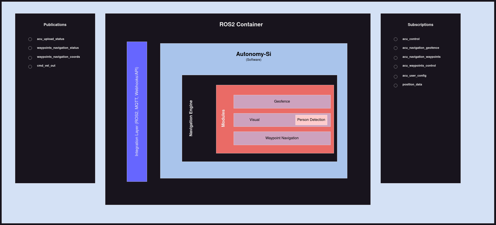
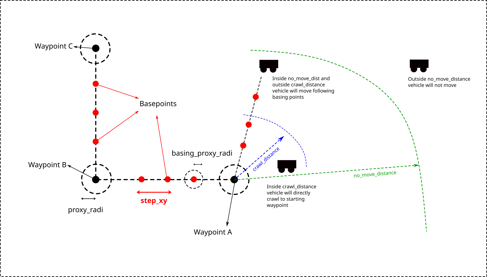

# AutonomySi Documentation

```
Index:
1. Updates
2. Topics
3. Definitions
```

__The application runs as a ROS2 node__  


## Updates

In case updates has been pushed use the following commands to restart the container
1. Stop the already running service
```
sudo systemctl stop container-autonomy-si-ros2.service
sudo podman images
sudo podman rmi <image_id>
```

2. Pull the latest container
```
sudo podman login <ip-address>:<port>       # credentials will be provided
sudo podman pull <ip-address>:<port>/atonomy-si/ros2:v1.2
```

3. Run the container
```
sudo systemctl start container-autonomy-si-ros2.service
```


### Topics list
The following topics has been subscribed and published when AutonomySi is powered on.  

|       topic       |        msg_type       |        msg        |    Description    |
|-------------------|-----------------------|-------------------|-------------------|
| __Subscriptions__ |                       |                   |                   |
|     `acu_control`          | std_msgs/msg/String   |                                  `kill`                                 |   this message kills the ACU as well as the sends a kill msg to VCU over CAN ID 19  |
|            `-`             | std_msgs/msg/String   |                                 `reset`                                 | this message resets the ACU, in case kill msg has been send `reset` will remove the kill lock from VCU by sending msg over CAN ID 19   |
|            `-`             | std_msgs/msg/String   |                                 `real/simulation`                                 | this message sets the ACU, in `real` or `simulation` mode. Default value is real  |
| `acu_navigation_geofence`  | std_msgs/msg/String   | `{"geojson": [[lon1, lat1], [lon2, lat2], [lon3, lat3], [lon4, lat4]]}` | this topic looks for the stringyfied json  |
| `acu_navigation_waypoints` | std_msgs/msg/String   | `{"waypoints": [[lon1, lat1], [lon2, lat2], [lon3, lat3]]}` | this topic looks for the stringyfied json  |
| `acu_waypoints_control`    | std_msgs/msg/String   |                                 `start`                                 | this msg starts the waypoint navigation, it is required to first upload the waypoints and geofence in order to start the waypoint navigation  |
|          `-`               | std_msgs/msg/String   |                                 `stop`                                  | this msg stops the waypoint navigation, it also flushes the waypoints data, so it is necessary to upload the data again  |
| `acu_user_config` | std_msgs/msg/String | *msg format described below*<sup> #</sup> | this topic receives the configuration parameters, but will be overwritten by default once you restart the ACU |
| `position_data`<sup> *</sup> | std_msgs/msg/String | `{"heading": float, "latitude": float, "longitude": float}` | this topic receives position data in the given format
| __Publications__ |                       |                   |                   |
| `acu_upload_status` | std_msgs/msg/String | `{"status": "ok/failed", "type": "upload". "message": "geofence/waypoints (not) updated"}` | this message shows the upload status id geofence/waypoints coordinates |
| `waypoints_navigation_status` | std_msgs/msg/String | `started\|running\|successful\|failed` | this message show the waypoint navigation running status (the message will be updated in future versions) |
| `waypoints_navigation_coords` | std_msgs/msg/String | `{"heading": float, "latitude": float, "longitude": float}` | this message gives the live position status of the vehicle |
| `cmd_vel_out`<sup> *</sup> | geometry/msgs_msg/Twist | *msg format described below*<sup> #</sup> | this topic publishes control msg for Gazebo simulation |


## \* Only for simulation mode

## # Message format:

__Configuration__ these parameters should be send in the nested format, for example if you want to update one parameter, you should sent the complete json
Note: Could be changed in future versions
```
interface:
  can0:
    arbitration_id:
      battery: 
        id: 769     # Hexadecimal: 301 | Decimal: 769
      kill: 
        id: 19      # Hexadecimal: 13  | Decimal: 19
        kill_msg: 0
        release_msg: 1         
      control: 
        id: 580     # Hexadecimal: 244 | Decimal: 580
        steering_max: 127   #0-127
        throttle_max: 127    #0-127
        throttle_turn_sensitivity: 0.5 # 0-1
        steering_turn_sensitivity: 0.9 # 0-1
        steering_sensitivity: 0.6 # 0-1
        throttle_sensitivity: 0.8 # 0-1
  ros2:
    max_x: 1
    max_z: 1
    x_sensitivity: 0.9
    z_sensitivity: 0.6
    x_turn_sensitivity: 0.4
    z_turn_sensitivity: 0.9
    
    
navigation:
  geofence: 
    active: True
  visual: 
    active: True
  waypoints: 
    active: True
    step_xy: 10       #in meters
    proxy_radi: 1
    basing_proxy_radi: 1
    bearing_tol: 10
    crawl_dist: 5        # should be less than equal to step_xy
    no_move_dist: 100
```
__Twist__ cmd_vel_out message format
```
{"linear":
        {"x": 0.0, 
         "y": 0.0, 
         "z": 0.0}, 
"angular": 
        {"x": 0.0, 
         "y": 0.0, 
         "z": 0.0}}
```

## Parameter definitions

### Waypoints

__Waypoints__: They refer to the GPS coordinates that establish the path for the vehicle's movement. The path defined in this manner is divided into segments consisting of coordinates known as basepoints.

__step_xy__: It defines the distance between the consecutive basepoints on the path connected by the waypoints. This controls how many basepoints will be created given a set of waypoints. The units used here are in meters (m).

__no_move_distance__: It defines the maximum distance of the starting position of the vehicle from the first waypoint within which the vehicle will begin moving. If the distance to the vehicle is greater than the no_move_distance, then the vehicle will not move. Once the vehicle is within the no_move_distance, then it will move by following the basing points until it reaches the crawl_distance. The units used here is meters (m).

__crawl_distance__: It defines the distance within which the vehicle will move directly to the waypoint without following any basepoints (if any) within this distance. So, once the vehicle is within the crawl_distance then it will directly move to the waypoint until it reaches the __proxy_radi__. The units used here is in meters (m).

__proxy_radi__: It defines the distance within which the vehicle will stop following the current waypoint and start following the nearest basepoint between the current and the next waypoint. It also updates the current waypoint to the next waypoint. It will then continue to move towards the nearest basing point till it reaches the __basing_proxy_radi__. The units used here is in meters (m).

__basing_proxy_radi__: It defines the distance within which the vehicle stops following the current basepoint and updates the current basepoint as the next nearest basepoint and starts following it until it reaches the __basing_proxy_radi__ of the next basepoint. The process continues until it reaches the __proxy_radi__ of the next waypoint where it changes its course accordingly. The units used here is in meters (m).


### Control (Vamana):
__steering_max__: This is the absolute maximum value of the steering that the CAN bus can take, signifying the maximum turn rate of the vehicle in either direction. This parameter takes a hard-coded value of 127 and should NOT be changed until unless changed in the VCU.

__throttle_max__: This is the absolute maximum value of the throttle that the CAN bus can take, signifying the maximum speed of the vehicle in the direction of the vehicle’s heading. This parameter takes a hard-coded value of 127 and should NOT be changed until unless changed in the VCU. 

__throttle_turn_sensitivity__: It defines the sensitivity of the throttle values while the vehicle takes a turn. The input values range from [0,1]. The expected value of this argument is always much less than 1 because this slows down the vehicle at the turn. 

__steering_turn_sensitivity__: It defines the sensitivity of the steering values while the vehicle takes a turn. The input values range from [0,1]. The expected value of this argument is always close to 1. Since the vehicle slows down due to the parameter __throttle_turn_sensitivity__, we need to have the steering values as close to the __steering_max__ as possible to prevent any path deviations in the vehicle at sharper turns.

__steering_sensitivity__: It defines the sensitivity of the steering values while the vehicle is following the path between the waypoints and has not yet reached any turns. The input values range from [0,1]. The expected value of this argument is always much less than 1 to prevent any wobble in the vehicle path.

__throttle_sensitivity__: It defines the sensitivity of the throttle values while the vehicle is following the path between the waypoints and has not yet reached any turns. The input values range from [0,1]. The expected value of this argument is always close to 1 because the path followed by the vehicle is almost a straight line between the waypoints and combined with the __steering_sensitivity__ it can provide a less jerky experience for the vehicle.

### Control (Gazebo):
__max_x__: This is the absolute maximum value of the throttle that the Gazebo simulation can take, signifying the maximum speed of the vehicle in the direction of the vehicle’s heading. This parameter takes the value according to the Gazebo environment mappings. By default it is set to 1.

__max_z__: This is the absolute maximum value of the steering that the Gazebo simulation can take, signifying the maximum turn rate (rad/s) of the vehicle in either direction. This parameter takes the value according to the Gazebo environment mappings. By default it is set to 1.

__x_sensitivity__: It defines the sensitivity of the throttle values while the vehicle is following the path between the waypoints and has not yet reached any turns. The input values range from [0,1]. The expected value of this argument is always close to 1 because the path followed by the vehicle is almost a straight line between the waypoints and combined with the __z_sensitivity__ it can provide a less jerky experience for the vehicle.

__z_sensitivity__:  It defines the sensitivity of the steering values while the vehicle is following the path between the waypoints and has not yet reached any turns. The input values range from [0,1]. The expected value of this argument is always much less than 1 to prevent any wobble in the vehicle path.

__x_turn_sensitivity__: It defines the sensitivity of the throttle values while the vehicle takes a turn. The input values range from [0,1]. The expected value of this argument is always much less than 1 because this slows down the vehicle at the turn.

__z_turn_sensitivity__: It defines the sensitivity of the steering values while the vehicle takes a turn. The input values range from [0,1]. The expected value of this argument is always close to 1. Since the vehicle slows down due to the parameter __x_turn_sensitivity__, we need to have the steering values as close to the __max_z__ as possible to prevent any path deviations in the vehicle at sharper turns.  


